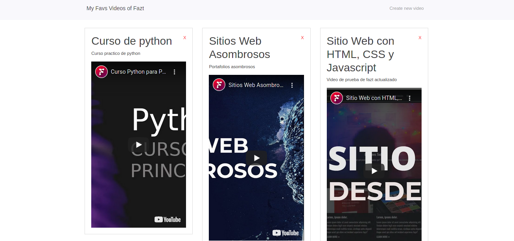

# Videos App With Typescript and React

This app was built with typescript for the api and react with typescript for the backend.
You can add a new video with a: 
- title what you want
- description what you want
- url from youtube

You can also edit and delete.

This is just for *practice* react with typescript template.

## Technologies used for this project :computer:

- [typescript](https://www.typescriptlang.org/)
- [nodejs](https://nodejs.org/en/)
- [mongodb](https://nodejs.org/en/)
- [react](https://reactjs.org)

## Screenshots :camera:



## Hacking

> The database (mongo) must be have running at port 27017 (default port)

```cmd
git clone https://github.com/gabrielba15/typescript-mearn-stack.git 
cd typescript-mearn-stack

# backend
cd backend
npm install  
npm start

# frontend
cd frontend
yarn install 
yarn start
```

> Ready, happy hacking :D
